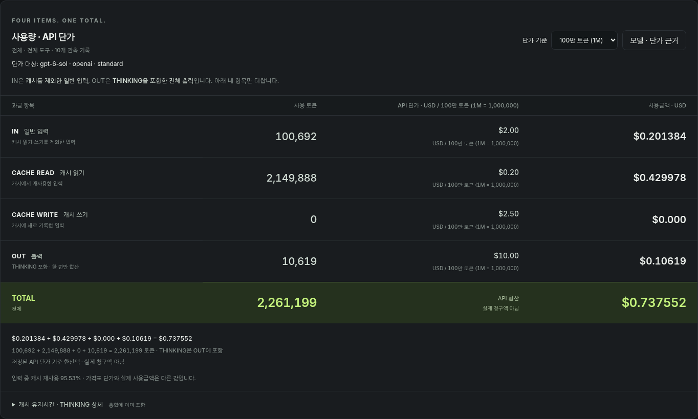
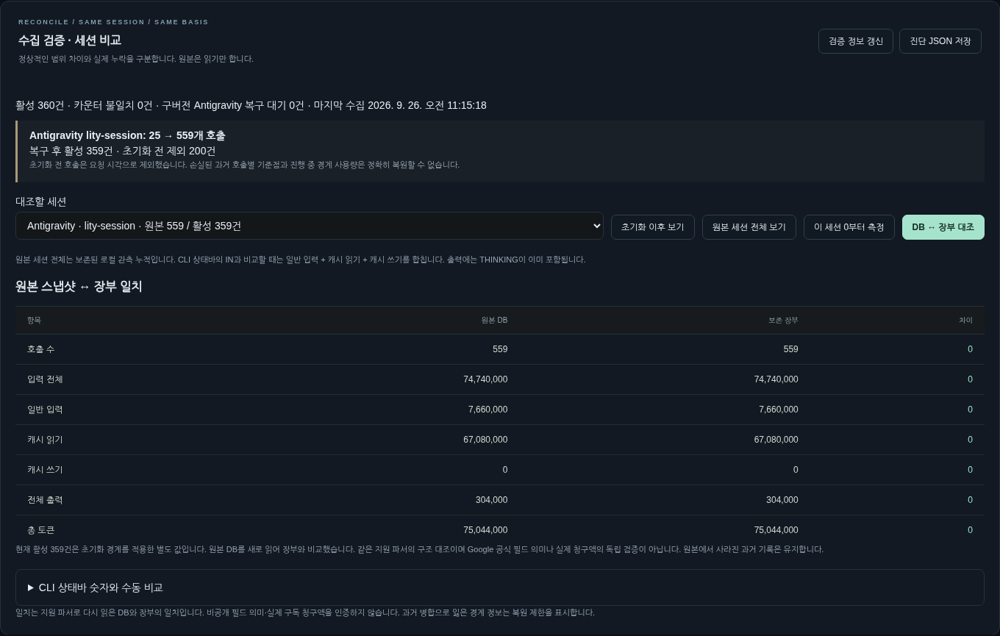

# Token Meter Local 0.10.1

**같은 세션, 같은 초기화 경계, 같은 토큰 정의로 비교하는 로컬 사용량 계기.**

Codex · Claude Code · Antigravity의 로컬 기록을 수집합니다. 일반 입력 / 캐시 읽기 / 캐시 쓰기 / 출력(THINKING 포함)을 분리하고, 토큰·저장된 API 단가·환산 금액을 표시합니다.

0.10.0에서 **Antigravity의 여러 호출이 하나로 합쳐지던 오류를 고치고 기존 기록의 재구성·세션별 원본 대조를 추가**했습니다. 0.10.1에서는 같은 호출의 본 기록과 동일한 재시도 기록이 중복 집계되는 문제를 고치고, SQLite 메타데이터 읽기 한도를 BLOB당 16MiB로 늘렸습니다. 반복 ID 사례는 합성 데이터로 재현했고, 개발 기기의 로컬 기록으로 수집·복구를 추가 확인했습니다. 이 저장소와 배포 파일에는 개인 원본 DB를 포함하지 않습니다. 실제 청구 정확도를 보증하지 않습니다.

## 화면 미리보기

아래 화면은 **합성 데이터**를 실제 앱에서 표시한 예시입니다. 개인 사용량이나 실제 청구 내역이 아닙니다.

| 사용량·API 단가 | 같은 세션의 원본↔장부 검증 |
|---|---|
| 일반 입력·캐시 읽기·캐시 쓰기·출력을 분리하고 저장된 단가로 환산 | 초기화 경계를 유지하면서 호출 수와 토큰 차이를 확인 |





### Preview in English

These screens use synthetic demo data, not personal usage or actual charges. Token Meter Local separates ordinary input, cache reads, cache writes, and output (including thinking), then shows estimated costs using saved API rates. The reconciliation screen compares a session's local source records with its ledger while preserving the reset boundary.

Version 0.10.1 counts identical primary/retry observations once, keeps distinct calls separate, and reads supported SQLite metadata blobs up to 16 MiB. Install the VSIX in VS Code and reload the window. The estimates do not verify a provider invoice.

## 1. 설치와 업그레이드

VS Code에는 **`token-meter-local-0.10.1.vsix` 하나만** 설치합니다.

1. VS Code 확장 → `…` → **Install from VSIX…** → 파일 선택.
2. 작업 저장 → 명령 팔레트 **Developer: Reload Window**.
3. 기존 브라우저 대시보드 탭을 닫고 하단 **TM**으로 다시 엽니다.
4. **LOCAL / 0.10.1** 확인. 구버전이면 **Token Meter: Restart Collector**.
5. 첫 수집이 끝나면 **수집 검증 · 세션 비교**에서 복구 결과를 확인합니다.

**복구를 위해 전체 초기화를 다시 누르지 마세요.** 기존 `~/.token-meter`, `active-data.json`, `data-epochs`를 그대로 둡니다. 이 버전 설치 자체는 전체 초기화나 AI 작업 중단이 아닙니다.

원본 DB가 남아 있으면 처음 수집할 때 해당 Antigravity 세션을 백업 후 재구성합니다. Codex/Claude 수집 경로·가격 계산 코드는 그대로 유지합니다. 설치 파일을 각 AI 앱 폴더로 복사할 필요는 없습니다.

이 VSIX는 GitHub Release에서 내려받아 로컬에 설치하는 파일입니다. Marketplace나 운영 업데이트 서버에 연결된 공식 배포가 아닙니다.

## 2. 이번 결함과 수정 범위

0.10.1은 본 호출과 내용·강한 요청 식별자가 같은 재시도 관측을 한 번만 세며, 실제로 다른 재시도는 별도 호출로 남깁니다. 이전 v4 장부의 중복 이벤트는 백업과 복구 계획을 만든 뒤 정리합니다.

이전 파서는 Antigravity protobuf root field 4의 상위/배치 ID를 요청의 중복 제거 키로 사용했습니다. 여러 호출이 이 값을 공유하면, 서로 다른 요청도 하나로 합쳐졌습니다.

**재현 시험:** 559개 생성 기록 중 535개가 같은 상위 ID를 공유하도록 만든 실제 SQLite 파일에서, 이전 코드는 25개 이벤트만 남겼습니다. 새 코드는 559개를 유지하고, 같은 호출을 중복 기록한 559개 step은 추가 청구로 세지 않습니다. 이 숫자는 보고된 구조를 재현한 테스트이지 사용자 DB 재분석 결과가 아닙니다.

새 기준은 **세션 + 생성 행 번호 + 재시도 위치**입니다. root field 4는 재사용 진단에만 쓰며 요청 ID로 사용하지 않습니다. step은 응답 ID 등의 명시적 근거나 유일한 step-index 연결이 있을 때만 해당 생성에 병합합니다. 응답 ID 자체가 여러 생성에 재사용되면 생성들은 보존하고 모호한 step은 제외·경고합니다.

기존 Codex 파서와 단가 파일은 원본 SHA-256과 일치합니다. 보고된 Codex 95건/입력 10,502,334/캐시 10,254,592/일반 247,742/출력 46,913/추론 17,584 패턴은 별도 회귀 시험에서 그대로 유지됐습니다.

## 3. 실제 사용자가 먼저 확인할 화면

**상단 `검증` → 세션 선택**. 같은 세션의 두 집계 범위를 직접 전환합니다.

| 버튼 | 보는 범위 | 데이터 변경 |
|---|---|---|
| 초기화 이후 보기 | 현재 활성 데이터, 전체 초기화 경계 이후 | 보기만 변경 |
| 원본 세션 전체 보기 | 보존한 해당 세션의 원본 관측 카운터, 초기화 전 포함 | 보기만 변경 |
| 이 세션 0부터 측정 | 해당 도구·세션만 새 측정하고 상태바 고정 | 새 측정 생성, 원래 누적 보존 |
| DB ↔ 장부 대조 | Antigravity 원본 재수집 후 새로 읽은 카운터와 장부 비교 | 원본은 읽기 전용; 새 관측은 장부에 반영 |
| 진단 JSON 저장 | 경로·본문·접근키를 제외한 상태·카운터·세션 해시 | 로컬 파일 내보내기 |

상단에는 **초기화 시각, 포함 도구, 세션 수, 비교용 입력 전체**가 명시됩니다. `전체 도구 / 오늘`은 하나의 Antigravity CLI 세션과 같은 범위가 아닙니다.

`원본 세션 전체`도 이 도구가 읽거나 보존한 로컬 기록입니다. 삭제된 원본이나 다른 컴퓨터의 계정 전체 내역을 가져오는 것은 아닙니다. 처음부터 빠진 요청이 있다면 이 보기도 완전한 계정 총량이 아닙니다.

### CLI 값 수동 대조

`CLI 상태바 값과 대조`에서 숫자와 의미를 지정합니다. `1.36M`, `41.2k`처럼 축약된 값도 입력할 수 있습니다. 마지막 표시 자릿수의 반올림 허용 범위를 적용합니다.

입력이 **전체 입력인지 일반 입력만인지**, 출력이 **THINKING 포함인지 비추론만인지** 직접 선택합니다. 같은 세션·시점이어야 합니다. 현재 컨텍스트 크기·최근 요청·누적 소비는 서로 다른 지표이므로 CLI가 어느 것을 표시하는지도 확인하세요. CLI가 반올림이 아닌 절삭을 사용한다면 원 단위 수치를 확인하세요. 제공된 상태바 숫자의 의미를 추측해 강제로 일치시키지 않습니다.

## 4. IN 정의와 가격

```
비교용 입력 전체 = IN(일반) + CACHE READ + CACHE WRITE
OUT = THINKING을 한 번 포함한 전체 출력
TOTAL = 비교용 입력 전체 + OUT
```

API 단가는 기본 **USD / 100만 토큰**입니다. 각 요청에 저장된 공급자·모델·모드·날짜·요청 길이 조건을 사용합니다. 혼합 집계에 현재 모델 하나의 가격을 곱하지 않습니다.

CACHE WRITE는 코드 파일 편집 횟수가 아닙니다. 서버 프롬프트 캐시의 쓰기 카운터입니다. 명시적 0과 필드 미기록을 구분하며 미기록은 비용 분리 불가/참고 환산으로 남습니다.

이번 버전은 **단가 전체를 새로 검증하거나 실제 청구액을 조회한 버전이 아닙니다.** Antigravity의 모델 enum 및 THINKING 필드 해석은 비공개 형식에 대한 참고 해석입니다. 전체 출력이 기록돼 있으면 그 합계를 쓰며 추론을 중복 가산하지 않습니다.

## 5. 손상된 기존 기록의 복구와 한계

복구 유형에 따라 활성 폴더에 `ledger.pre-0.10.0.json` 또는 `ledger.pre-0.10.1.json`을 만들어 원본 장부를 보존합니다. ID 교체 계획은 복구 계획 파일에 먼저 저장합니다. 이전 잘못 병합되거나 중복된 ID는 보존 로그에 `retired` 수정본을 남겨 합계에서 퇴역시키고, 새 호출별 기록을 추가합니다. 재시작해도 구 ID와 신 ID를 이중 합산하지 않습니다.

**전체 초기화 경계는 이동하거나 삭제하지 않습니다.** 과거 기준점이 새 호출 하나에 정확히 대응하면 옮깁니다. 하나의 구 기록에 수백 호출이 섞인 경우에는 원본 요청 시각으로 초기화 이전 호출을 제외합니다.

다만 이전 프로그램이 잃어버린 **초기화 순간의 호출별 카운터**, 특히 그 시점에 진행 중이던 요청의 중간 사용량은 완전히 복원할 수 없습니다. 이를 `과거 경계 복원 제한`으로 표시합니다. 원본 DB가 없거나 파싱 오류가 있으면 임의의 0 또는 추정 복구로 덮지 않고 기존 기록·경고를 유지합니다.

이미 종료한 측정의 숫자는 자동 수정하지 않습니다. 구버전 Antigravity 기록이 포함된 고정 측정에는 **정확한 총량이 아니라는 경고**를 추가합니다. 진행 중 측정에는 복구 가능한 기준점만 연결하고 경계 제한을 표시합니다.

**전체 폴더를 백업하세요.** 활성 포인터, epoch 폴더, 복구 계획, 월별 로그를 일부만 지우거나 구버전으로 되돌리면 올바른 상태를 잃을 수 있습니다. 자동 백업 복원/보안 완전 삭제 UI는 없습니다.

## 6. 유지한 실사용 기능

도구·모델별 비파괴 재측정, 초기화 취소, 이름/메모/수동 PASS·FAIL, 최대 4개 측정 비교, 선택·전체 측정 삭제, 전체 사용량 초기화, 월별 수정 로그, 과거 이력 검색/페이지 조회/CSV·JSONL, 사용자 단가·모델 가격표 갱신, 모델·단가 매칭 진단, 수동 원화 환율, 예산 경고, 미니바와 VS Code 상태바를 유지합니다.

긴 읽기·저장 작업 후에는 다음 자동 수집의 대기 간격을 **기본 설정 이상~최대 60초**로 늘려 연속 부하를 줄입니다. `지금 수집`은 수동으로 실행할 수 있습니다. 큰 장부에는 자원 사용 경고가 나옵니다. 이 간격 조절은 메모리 사용량 문제를 해결하는 기능은 아닙니다.

## 7. 독립 실행과 원본 검증 도구

VS Code 1.95+ 또는 독립 실행 Node.js 20+. Antigravity 읽기에는 실행 Node의 `node:sqlite` 또는 SQLite 모듈이 있는 Python 3가 필요합니다. 외부 npm 실행 의존성은 없습니다. **별도 Node 설치가 VS Code 내부 Node 버전을 바꾸지는 않습니다.**

소스 ZIP을 풀면 `token-meter` 폴더입니다. 기존 수집기를 먼저 종료하고 새 코드로 시작합니다.

```sh
node bin/cli.js stop
node bin/cli.js serve --open
```

다른 터미널에서:

```sh
node bin/cli.js doctor
node bin/cli.js sessions
node bin/cli.js verify --session antigravity:YOUR_SESSION_ID
node bin/cli.js status --scope session --provider antigravity --session antigravity:YOUR_SESSION_ID --dataset source --json
node bin/cli.js diagnostics > token-meter-diagnostics.json
```

JS 파서와 다른 구현으로 1차 카운터를 대조하려면:

```sh
python3 scripts/verify-antigravity.py /absolute/path/to/conversation.db
```

이 Python 도구는 실제 파일을 읽기 전용으로 열고 `gen_metadata`의 본 호출·재시도만 합산합니다. JS alias 로직, 가격, 초기화 경계를 쓰지 않습니다. **단독 step 사용량은 포함하지 않으며, 같은 비공개 필드 의미를 가정하기 때문에 Google 공식 스키마의 독립 인증은 아닙니다.** 원본 본문·경로·인증키를 결과에 출력하지 않습니다.

## 8. 검증 결과와 운영 한계

[0.10.1 검증 보고서](docs/TEST-REPORT-0.10.1.md)와 [0.10.0 검증 보고서](docs/TEST-REPORT.md), [ID·복구·대조 계약](docs/RELIABILITY.md)에 검사 내용과 한계를 구분했습니다. 개발 기기의 로컬 대조 결과를 다른 사용자 환경이나 실제 청구액의 검증으로 일반화하지 않습니다.

현재 장부는 JSON + 월별 JSONL입니다. **2만 호출/4만 메타데이터 행 시험은 통과했지만 같은 프로세스에서 재시작 상황을 새 수집기 객체로 시험한 전체 실행의 최대 RSS가 약 1.64GiB였습니다. 정상 단일 수집기의 고정 메모리 사용량이라는 뜻은 아닙니다.** 장기 대형 장부용 경량 데이터베이스로 바꾼 것은 아니며, 저사양 장치·수백만 요청의 메모리/속도를 보증하지 않습니다. 로그와 백업을 자동 삭제하지 않으므로 디스크 공간도 필요합니다.

읽기 제한은 DB당 총 50,000 메타데이터 행 및 사용량 후보(재시도 포함), 총 128MiB, BLOB당 16MiB, worker 약 20초입니다. 오류/한도 초과는 직전 관측을 유지하고 표시합니다. 전체 초기화 기준점 최대 100,000 ID, 동시 측정 12개/보관 500개 제한은 유지합니다.

개발 기기의 macOS에서 VSIX 설치·실제 로컬 DB 수집·세션 대조·확장 재로드를 확인했습니다. Windows·다른 사용자 환경·실청구액, 구형 Antigravity `.pb`, 계정 구독 한도, 여러 PC 합산, OS 네이티브 메뉴바, 실제 자동 업데이트 서버는 검증하거나 구현 완료한 것으로 주장하지 않습니다. PiP는 지원 브라우저와 부모 대시보드가 필요합니다.

원본 프롬프트·응답·추론 본문·코드·인증키를 사용 로그에 저장하지 않습니다. 로컬 메타데이터와 사용자가 적은 메모도 민감할 수 있습니다. `runtime.json`과 `#key=` 주소를 공유하지 마세요. 이 제품은 동일 OS 사용자 권한을 장악한 악성 코드에 대한 샌드박스가 아닙니다.

MIT. AI 공급자 또는 Microsoft의 공식·인증 확장이 아닙니다.
